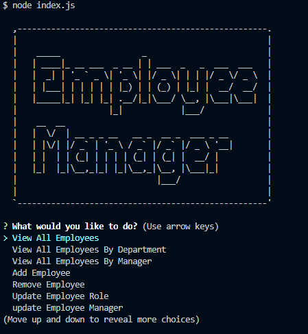

# Employee_Manager

Employee Manager is a node based application that allows you to manage a team based on managment, department, salary, and roles.

#Motivation

This application allow you to manage your entire staff easily all in one spot. With this you can create new departments, add employees, change management, edit roles, along with many other functions. 

#Tech Used

This application uses the following:

Javascript
Mysql
Node

Use the package manager npm to install all required dependencies:

```bash
npm install
```

#Usage

```bash
node index.js
```
This will launch the application in your bash terminal. There you can use your up and down arrow keys to scroll through the application.



## License  
[MIT](https://choosealicense.com/licenses/mit/)